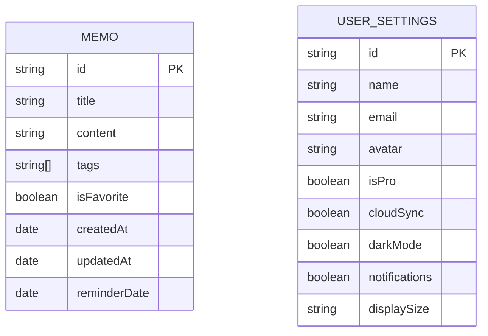

## 1. Architecture Design

```mermaid
graph TB
    subgraph "Frontend (Next.js 15)"
        A[Pages/Routes]
        B[Components]
        C[State Management (Zustand)]
        D[Styling (Tailwind CSS + shadcn/ui)]
    end
    
    subgraph "Data Layer"
        E[Local Storage]
        F[Mock API Service]
    end
    
    A --&gt; B
    B --&gt; C
    C --&gt; F
    F --&gt; E
    B --&gt; D
```

## 2. Technology Description

- **Frontend**: Next.js 15 + React 18 + TypeScript 5
- **Styling**: Tailwind CSS 4 + shadcn/ui
- **State Management**: Zustand
- **Routing**: Next.js App Router
- **Icons**: Lucide React
- **Build Tool**: Next.js built-in
- **Deployment**: Vercel (一键部署)

## 3. Route Definitions

| Route | Purpose |
|-------|---------|
| / | 首页 - 备忘录列表 |
| /memo/[id] | 备忘录详情页 |
| /memo/edit/[id] | 备忘录编辑页 (id为new时新建) |
| /settings | 设置页 |

## 4. Data Model

### 4.1 Data Model Definition



### 4.2 TypeScript Types

```typescript
// Memo 类型定义
interface Memo {
  id: string;
  title: string;
  content: string;
  tags: string[];
  isFavorite: boolean;
  createdAt: Date;
  updatedAt: Date;
  reminderDate?: Date;
}

// 用户设置类型定义
interface UserSettings {
  id: string;
  name: string;
  email: string;
  avatar: string;
  isPro: boolean;
  cloudSync: boolean;
  darkMode: boolean;
  notifications: boolean;
  displaySize: 'small' | 'medium' | 'large';
}

// 标签类型
type Tag = '全部' | '工作' | '生活' | '创意' | '学习';
```

## 5. File Structure

```
/workspace
├── .trae/
│   └── documents/
│       ├── prd.md
│       └── arch.md
├── public/
│   └── images/
├── src/
│   ├── app/
│   │   ├── layout.tsx
│   │   ├── page.tsx (首页)
│   │   ├── memo/
│   │   │   ├── [id]/
│   │   │   │   └── page.tsx (详情页)
│   │   │   └── edit/
│   │   │       └── [id]/
│   │   │           └── page.tsx (编辑页)
│   │   └── settings/
│   │       └── page.tsx (设置页)
│   ├── components/
│   │   ├── ui/ (shadcn/ui components)
│   │   ├── MemoCard.tsx
│   │   ├── MemoList.tsx
│   │   ├── TagFilter.tsx
│   │   ├── BottomNav.tsx
│   │   └── ...
│   ├── hooks/
│   │   ├── useMemos.ts
│   │   └── useSettings.ts
│   ├── store/
│   │   ├── useMemoStore.ts
│   │   └── useSettingsStore.ts
│   ├── lib/
│   │   ├── utils.ts
│   │   └── mockData.ts
│   └── types/
│       └── index.ts
├── package.json
├── tsconfig.json
├── tailwind.config.ts
├── next.config.ts
└── vercel.json
```

## 6. State Management (Zustand)

```typescript
// src/store/useMemoStore.ts
import { create } from 'zustand';
import { Memo } from '@/types';

interface MemoStore {
  memos: Memo[];
  selectedTag: string;
  searchQuery: string;
  addMemo: (memo: Omit&lt;Memo, 'id' | 'createdAt' | 'updatedAt'&gt;) =&gt; void;
  updateMemo: (id: string, memo: Partial&lt;Memo&gt;) =&gt; void;
  deleteMemo: (id: string) =&gt; void;
  toggleFavorite: (id: string) =&gt; void;
  setSelectedTag: (tag: string) =&gt; void;
  setSearchQuery: (query: string) =&gt; void;
  getFilteredMemos: () =&gt; Memo[];
}
```

## 7. Key Components Implementation Plan

1. **MemoCard**: 单个备忘录卡片，显示标题、预览、标签、操作按钮
2. **MemoList**: 备忘录列表，包含空状态和加载状态
3. **TagFilter**: 标签筛选组件
4. **BottomNav**: 底部导航栏
5. **SettingsSection**: 设置页面的分组组件
6. **Toolbar**: 编辑页面的工具栏

## 8. Mock Data

预先准备好的模拟数据将用于展示所有页面功能，包括：
- 4-5个示例备忘录
- 不同标签分类
- 收藏状态示例
- 用户设置数据
