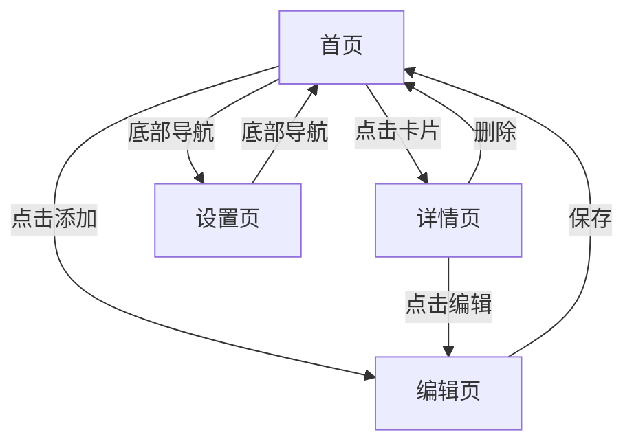

## 1. Product Overview

MemoFlow 是一款现代简洁的备忘录应用，旨在为用户提供优雅的笔记管理体验。它支持笔记的创建、编辑、查看、分类和搜索功能，完美适配移动端和桌面端。

- 核心价值：让用户能够快速记录想法、整理思路，并通过标签分类和强大的搜索功能高效管理内容
- 目标用户：所有需要简洁高效笔记应用的用户，从学生到专业人士

## 2. Core Features

### 2.1 User Roles (if applicable)

| Role | Registration Method | Core Permissions |
|------|---------------------|------------------|
| Normal User | 无需注册（本地存储） | 创建、编辑、删除备忘录，管理标签，配置设置 |

### 2.2 Feature Module

1. **首页（备忘录列表）**: 备忘录列表展示、标签筛选、搜索功能、添加新备忘录
2. **详情页**: 备忘录详情查看、编辑入口、删除功能
3. **编辑页**: 备忘录编辑、标签管理、附件添加
4. **设置页**: 用户信息、同步设置、通知偏好、数据管理

### 2.3 Page Details

| Page Name | Module Name | Feature description |
|-----------|-------------|---------------------|
| 首页（备忘录列表） | 导航栏 | 应用logo、搜索栏、筛选按钮 |
| 首页（备忘录列表） | 标签筛选 | 按标签快速筛选备忘录（全部、工作、生活、创意、学习） |
| 首页（备忘录列表） | 备忘录卡片列表 | 展示备忘录标题、预览内容、日期、标签、收藏/删除操作 |
| 首页（备忘录列表） | 底部导航 | 备忘录、设置页面切换 |
| 详情页 | 导航栏 | 返回按钮、分享、编辑 |
| 详情页 | 内容区域 | 标题、修改时间、提醒、标签、主要内容 |
| 详情页 | 操作栏 | 收藏、更多操作、删除 |
| 编辑页 | 导航栏 | 返回、保存 |
| 编辑页 | 内容编辑 | 标题输入、内容编辑 |
| 编辑页 | 标签管理 | 添加/管理标签 |
| 编辑页 | 工具栏 | 标签、提醒、图片、日期、文本格式、更多选项 |
| 设置页 | 导航栏 | 应用logo |
| 设置页 | 用户信息 | 头像、用户名、邮箱、会员状态 |
| 设置页 | 账户与同步 | 云端同步开关、立即同步、账户安全 |
| 设置页 | 通用偏好 | 深色模式、通知与提醒、显示设置 |
| 设置页 | 数据管理 | 备份与恢复、清理缓存 |
| 设置页 | 关于与支持 | 帮助中心、关于MemoFlow、退出登录 |
| 设置页 | 底部导航 | 备忘录、设置页面切换 |

## 3. Core Process

用户主要流程如下：
1. 用户打开应用，进入首页浏览备忘录列表
2. 用户可以使用标签筛选或搜索功能快速找到所需备忘录
3. 点击备忘录卡片查看详情
4. 在详情页可以编辑或删除备忘录
5. 点击右下角的添加按钮创建新备忘录
6. 在设置页可以配置应用偏好和管理数据

## 4. User Interface Design

### 4.1 Design Style

- **Primary and secondary colors**: 主色调为蓝色 (#3b82f6)，用于按钮、选中状态、强调元素；中性色使用灰白色系，营造简洁现代感
- **Button style**: 圆角按钮 (rounded-lg)，带有微妙的阴影和悬停效果
- **Font and sizes**: 使用 Inter 字体，标题使用较大字号和粗体，正文使用中等字号
- **Layout style**: 卡片式布局，清晰的视觉层级，充足的留白
- **Icon/emoji style suggestions**: 使用 Lucide React 图标库，保持图标风格一致

### 4.2 Page Design Overview

| Page Name | Module Name | UI Elements |
|-----------|-------------|-------------|
| 首页（备忘录列表） | 导航栏 | 左侧logo区域，中间搜索框，右侧筛选图标 |
| 首页（备忘录列表） | 标签筛选 | 圆角胶囊按钮，选中状态高亮显示 |
| 首页（备忘录列表） | 备忘录卡片 | 白色背景卡片，柔和阴影，包含标题、预览文本、日期标签、操作图标 |
| 首页（备忘录列表） | 浮动添加按钮 | 圆形蓝色按钮，带加号图标，位于右下角 |
| 首页（备忘录列表） | 底部导航 | 两个选项卡，图标+文字，选中状态高亮 |
| 详情页 | 导航栏 | 返回箭头、分享图标、编辑图标 |
| 详情页 | 内容区域 | 大标题，元数据信息（时间、提醒、标签），正文内容，创建时间 |
| 详情页 | 操作栏 | 收藏图标、更多菜单、红色删除按钮 |
| 编辑页 | 导航栏 | 返回箭头、保存对勾 |
| 编辑页 | 内容编辑 | 标题输入框，多行内容编辑区 |
| 编辑页 | 标签区域 | 圆角标签按钮，带加号添加按钮 |
| 编辑页 | 底部工具栏 | 图标按钮组（标签、提醒、图片、日期、格式、更多） |
| 设置页 | 用户信息 | 浅色背景卡片，左侧头像，右侧用户信息和会员标识 |
| 设置页 | 设置分组 | 分组标题，每个设置项为白色卡片，包含图标、标题、描述、开关或箭头 |
| 设置页 | 退出按钮 | 红色背景按钮，居中文字 |

### 4.3 Responsiveness

- 移动端优先设计，完美适配各种屏幕尺寸 (320px - 1440px+)
- 使用 Tailwind CSS 响应式断点 (sm, md, lg, xl)
- 触摸优化，按钮尺寸适合手指点击
- 在平板和桌面端展示更多内容，保持良好的阅读体验

### 4.4 3D Scene Guidance (if applicable)

本项目不涉及3D场景。
